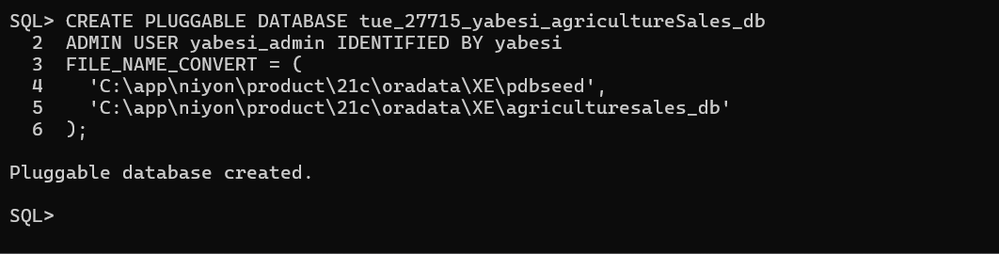

# **Regional Agricultural Sales Analysis Database**


## **Oracle PDB Implementation**   

## 
Student: NIYONKURU NYIRIMPETA Yabesi  
PDB Name: tue\_27715\_yabesi\_agricultureSales\_db  

---

###   Project Overview 

This project implements an Oracle \*\*Pluggable Database (PDB)\*\* dedicated to managing agricultural sales data across regions in Rwanda.  
It includes structured tables, PL/SQL logic, tablespaces, and performance configurations.

---

###  Objectives

\- Create a pluggable database  
\- Configure data, index, and temporary tablespaces  
\- Enable archive log mode  
\- Assign a super admin user  
\- Configure storage auto-extension  
\- Provide complete documentation  


---


### **# Naming Convention**  


Implemented:  

`tue\_27715\_yabesi\_agricultureSales\_db`


---


### **#  Admin User Configuration**  


| Parameter | Value |

|----------|--------|

| Username | `yabesi\_admin` |

| Password | `yabesi` |

| Privileges | Super Admin |

| Access | Full PDB control |


> Password used for academic purposes only.


---


#### **# Step 1 — PDB Creation**  


```sql

CREATE PLUGGABLE DATABASE tue_27715_yabesi_agricultureSales_db
ADMIN USER yabesi_admin IDENTIFIED BY yabesi
FILE_NAME_CONVERT = (
  'C:\app\niyon\product\21c\oradata\XE\pdbseed',
  'C:\app\niyon\product\21c\oradata\XE\agriculturesales_db'
);
```



#### **Step 2 — Open and Save PDB State**

```sql
ALTER PLUGGABLE DATABASE tue\_27715\_yabesi\_agricultureSales\_db OPEN;
ALTER PLUGGABLE DATABASE tue\_27715\_yabesi\_agricultureSales\_db SAVE STATE;
```


#### **Step 3 — Switch Session to PDB**


ALTER SESSION SET CONTAINER = tue\_27715\_yabesi\_agricultureSales\_db;


📷 Screenshot — Switch Session


#### **Step 4 — Tablespace Creation**


#### **4.1 Data Tablespace**


CREATE TABLESPACE agriculture\_data

DATAFILE 'C:\\app\\niyon\\product\\21c\\oradata\\XE\\agriculturesales\_db\\agriculture\_data01.dbf'

SIZE 100M

AUTOEXTEND ON NEXT 10M MAXSIZE UNLIMITED

EXTENT MANAGEMENT LOCAL

SEGMENT SPACE MANAGEMENT AUTO;


📷 Screenshot — Data Tablespace


#### **4.2 Index Tablespace**


CREATE TABLESPACE agriculture\_index

DATAFILE 'C:\\app\\niyon\\product\\21c\\oradata\\XE\\agriculturesales\_db\\agriculture\_index01.dbf'

SIZE 100M

AUTOEXTEND ON NEXT 10M MAXSIZE UNLIMITED;


📷 Screenshot — Index Tablespace


#### **4.3 Temporary Tablespace**


CREATE TEMPORARY TABLESPACE agriculture\_temp

TEMPFILE 'C:\\app\\niyon\\product\\21c\\oradata\\XE\\agriculturesales\_db\\agriculture\_temp01.dbf'

SIZE 50M

AUTOEXTEND ON NEXT 5M MAXSIZE UNLIMITED;


📷 Screenshot — Temp Tablespace


#### **Step 5 — Autoextend Configuration**


ALTER DATABASE DATAFILE 

'C:\\app\\niyon\\product\\21c\\oradata\\XE\\agriculturesales\_db\\agriculture\_data01.dbf'

AUTOEXTEND ON NEXT 20M MAXSIZE 2G;


📷 Screenshot — Autoextend Enabled


#### &nbsp;**Step 6 — Tablespaces Verification**

SELECT tablespace\_name, status, contents, extent\_management 

FROM dba\_tablespaces;


📷 Screenshot — Tablespace Verification Output


####  **Step 7 — Archive Log Mode Check**


SELECT log\_mode FROM v$database;


or:


ARCHIVE LOG LIST;


📷 Screenshot — Archive Log Mode


#### **Notes:**


Screenshots serve as evidence of implementation.


Database structure is optimized for performance.


Tablespaces are configured to auto-extend safely.


#### **Conclusion**


The Phase IV configuration successfully created and configured the Oracle pluggable database environment required for the project.

All deliverables including scripts, configuration, and evidence screenshots have been compiled and documented for evaluation.


